## Bulk Crafting

### Chests
Crafting a chest with logs directly results in four chests, simplifying the process of creating numerous chests without the need to convert logs into planks first.

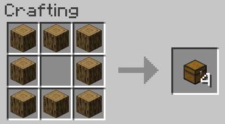

Stripped logs or any combination of log-types can be used interchangeably.

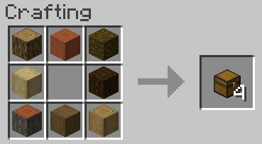

### Bone Blocks
Bone blocks can be directly crafted from bones.

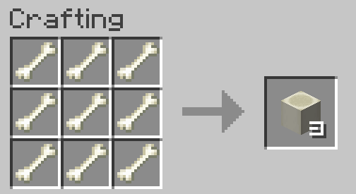

### Dispenser
Crafting a bow around a dropper provides a much easier way to bulk craft dispensers, while still retaining the original vanilla recipe.

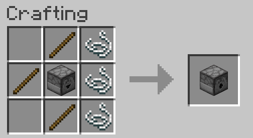

## Vanilla Crafting Rebalances
Vanilla crafting recipes have undergone minor changes:

### 6-Sided Logs
The 6-sided log crafting process has been modified to yield 4 wood instead of 3.

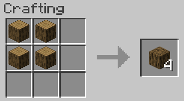

### Fermented Spider Eyes
Both red and brown mushrooms can be used to ferment spider eyes.

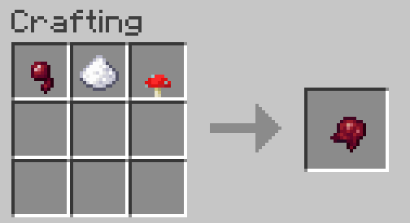

### Smithing Templates
All smithing template duplication costs have been reduced from 7 diamonds to 3.

## Bee Nests
To create "natural" bee nests, one can combine "artificial" beehives with honeycomb through crafting.

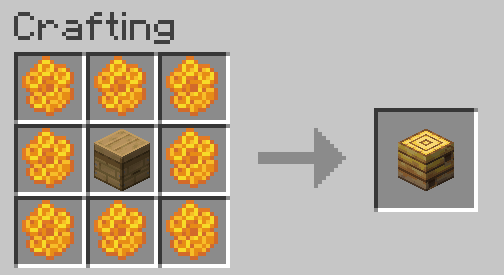

## Chainmail
To craft all types of chainmail armor, chains are required as the main material.

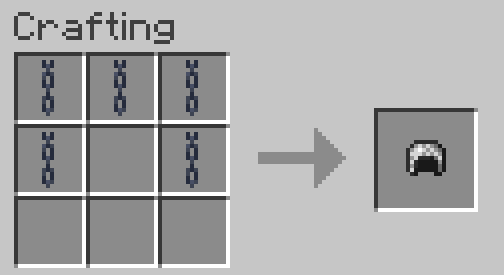

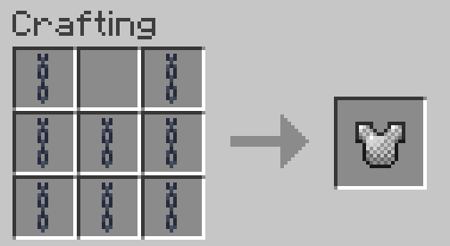

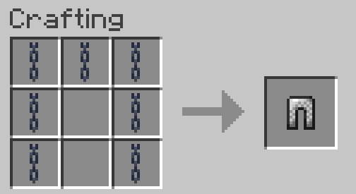

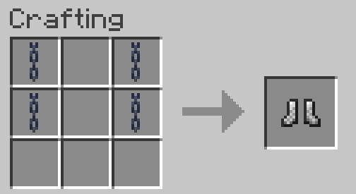

## End Crystal
Two additional end crystals can be acquired from the Dragon Egg, which is now a guaranteed drop from the Ender Dragon and can also be found in End City chests, in addition to the vanilla recipe.

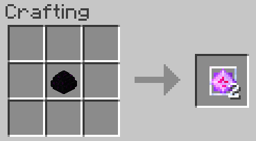

## Elytra
To craft an elytra, you need a Diamond Chestplate, an Ender Eye, a Chorus Flower, and 6 Phantom Membrane.

:::note
To craft this, prior visitation to The End dimension is a requirement.
:::

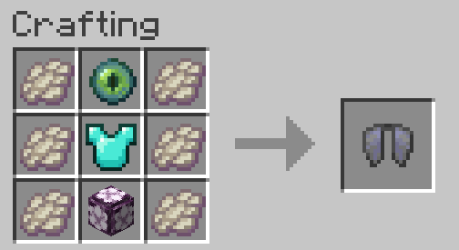

## Bottle-o-Enchanting
To craft an Experience Bottle, you will need 1 quartz, 1 glowstone dust, 3 sculk, and a water bottle.

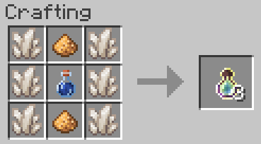

*Insert alternate updated recipe with Skulk*

## Trident
To craft a trident, you need three diamond swords for the tines and two conduits for the handle.

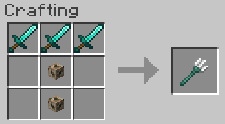

## Notch Apple
The duplication of Enchanted Golden Apples involves combining a regular golden apple, an enchanted golden apple, and 7 blocks of gold, which is not only reminiscent of the original vanilla recipe but also one ingot cheaper.

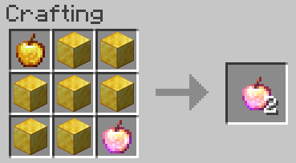

## Blackstone

### Blackstone
Blackstone, a type of block, can be produced by combining Basalt and Cobblestone, which are both materials that can be created using lava.

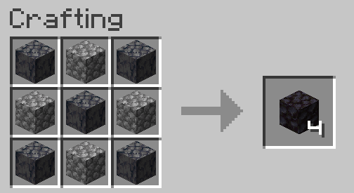

### Guilded Blackstone
The process of crafting Guilded Blackstone involves surrounding blackstone with gold nuggets.

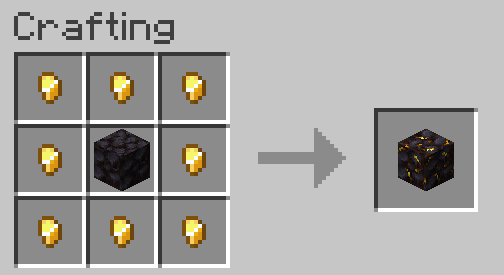

## Recraftable Gravel
Flint can be repacked into gravel.

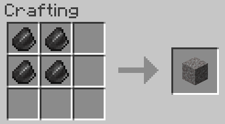

## Rotten Flesh
By crafting 9 rotten flesh, players can obtain 1 rabbit hide, which can then be used with the vanilla recipe to craft 4 rabbit hides into 1 piece of leather.

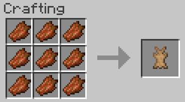

## Sponge Duplication
When sponge (wet or dry) is combined with coral blocks and corals, 4 sponges can be crafted. Coral or Coral Fans are interchangable, and any colour of Coral can be used, but all must be living.

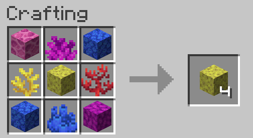

## Unpackable Clay
The crafting recipe for clay from clay balls can be reversed, allowing them to be used for villager trading or smelting into bricks.

## Unpackable Ice
The crafting recipes for Blue ice and Packed ice can be reversed, providing a convenient way to store ice or water.

### Blue Ice
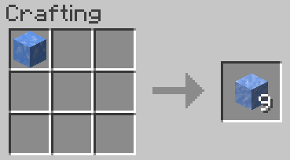

### Packed Ice
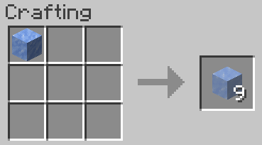