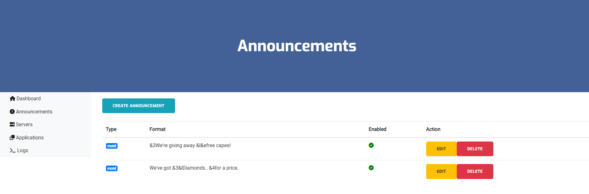
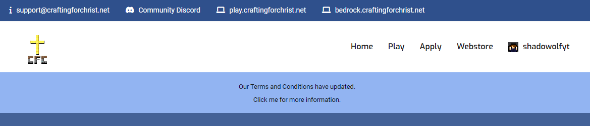
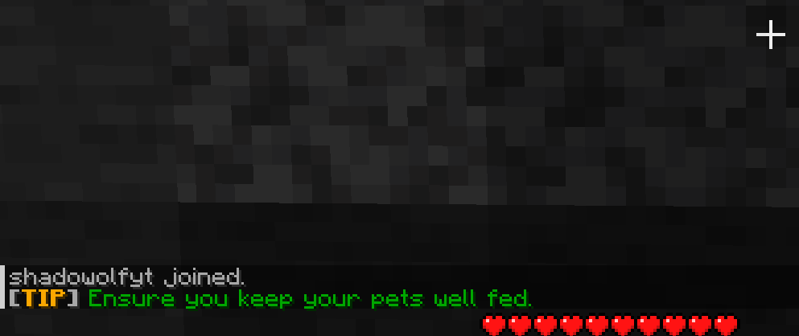
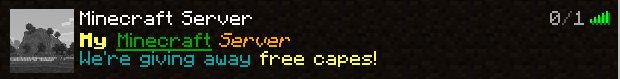
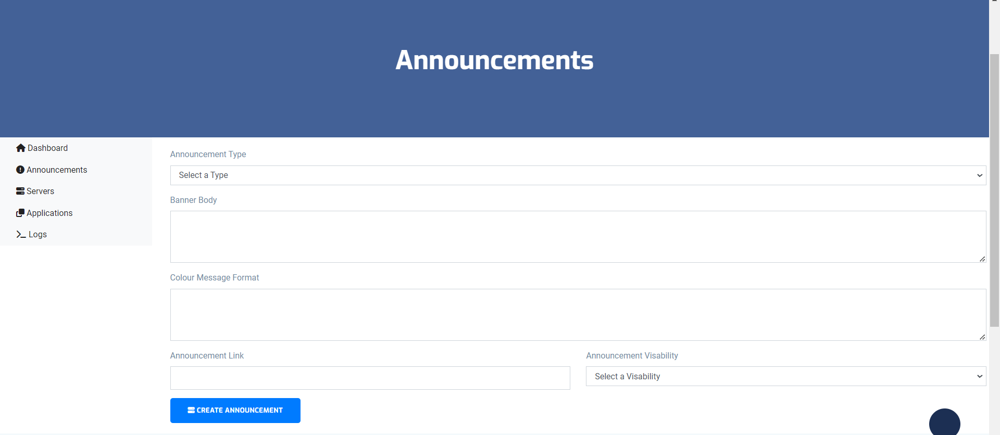

## Introduction
Announcements is a feature that allows Administration to broadcast messages across your Server and Website and have linked in to external URLs if required.

## Types of Announcements
> For tip and motd, it would be good to use a visualiser tool such as https://mctools.org/motd-creator

### web
Web announcements when created will be displayed as a blue banner on the header of your website. If you have more than one web announcement, the site will cycle the announcements on page load. If a link is specified, you can click anywhere on the banner to go to the directed link.

### Tip
Tip announcements when created will be displayed in-game as a little message and is broadcasted Network-wide. If you have more than one in-game tip announcement. If a link is specified, you can click anywhere on the banner to go to the directed link.

### MOTD (Message of The Day)
MOTD announcements when created will be displayed on the connection screen or the multiplayer ping screen. If you have more than one MOTD announcement they will cycle on each ping or refresh.

## Managing Announcements
Creating an announcement is easy, we've added some notes and options on how you can best create annnouncements for your Network.

### Announcement Type
Select the type of announcement (web, tip, motd)

### Banner Body
:::note
This only applies to Web announcements.
:::

The content of the banner for the announcement. 

### Colour Message Format
:::note
This only applies to Tip and MOTD announcements.
:::

The content of the banner for the announcement. You can use something like like this https://mctools.org/motd-creator to create and preview your message formats.

### Announcement Link
:::note
This only applies to Web and Tip announcements.
:::

The external link for the announcement to direct to.

### Announcement Visibility
Select whether to show or hide the announcement.