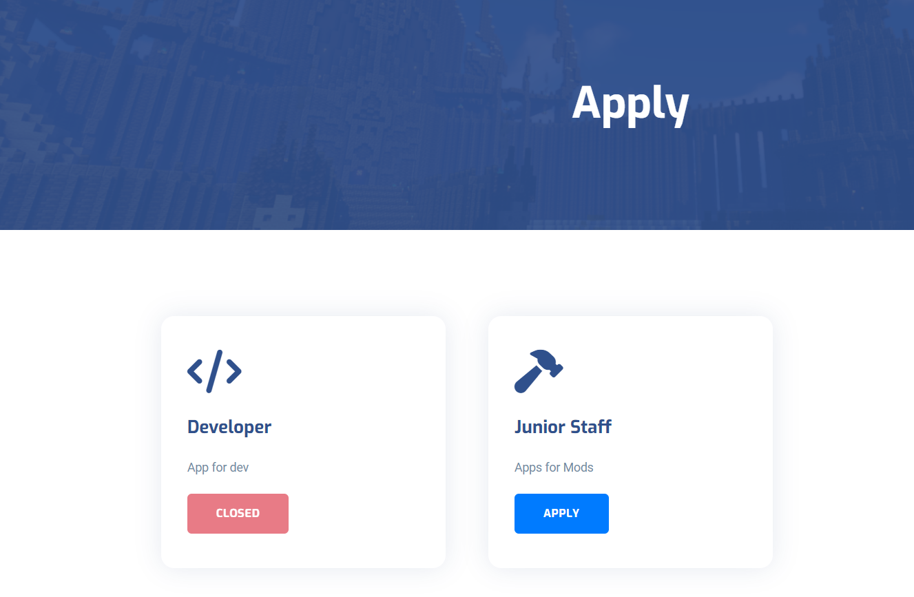
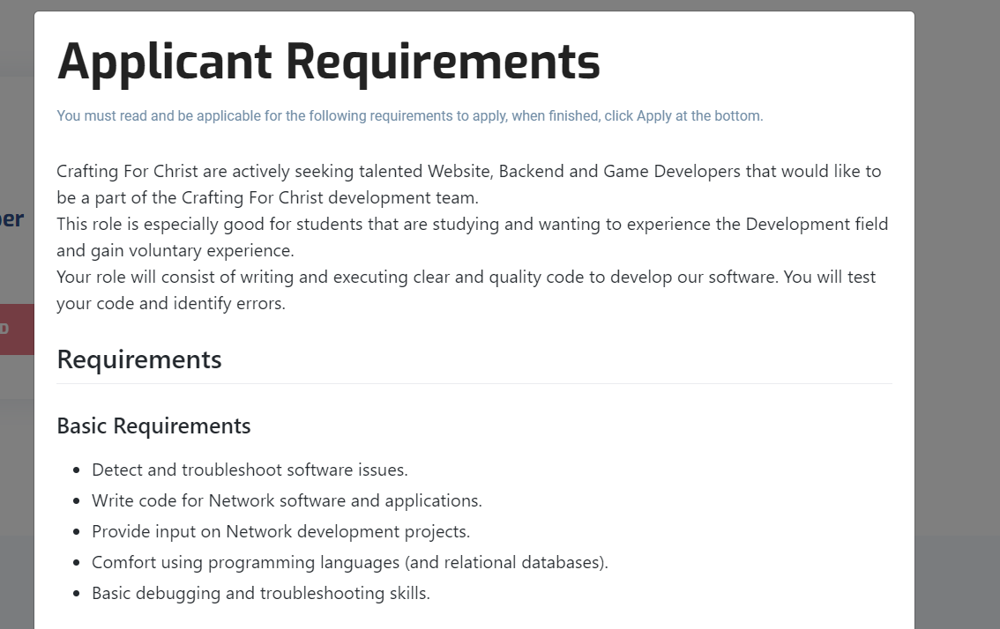
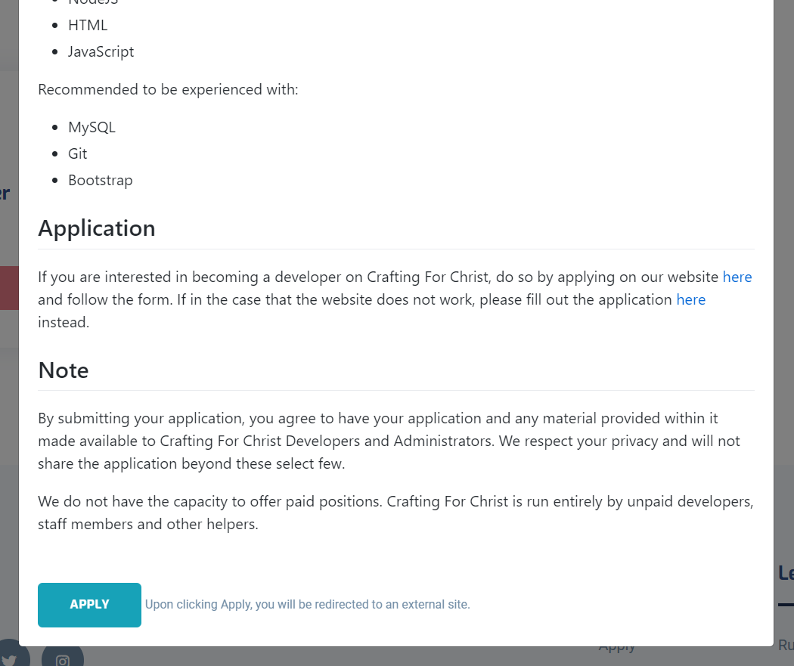
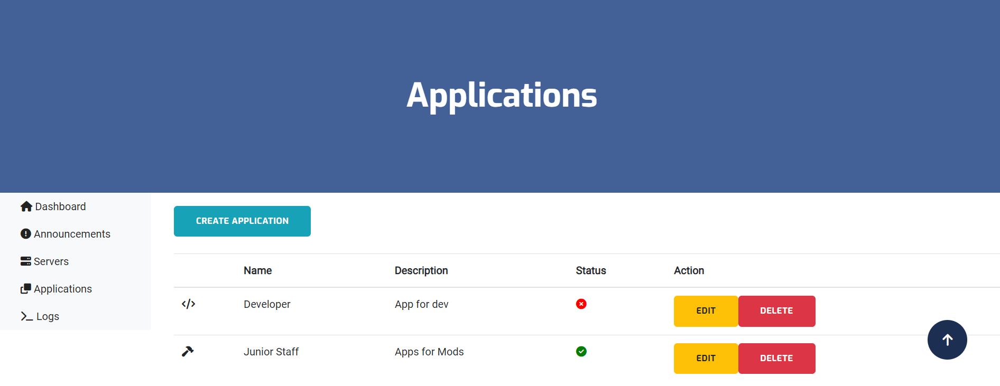

## Introduction
This feature allows administrative users to create, edit and delete applications. Applications are used for things like Server Position applications and other Server roles.

## Applications Overview
Applications are viewed in the order you specify.

When you select apply, it will appear an external box which will display the requirements.

At the bottom of the box it will have the Apply button which will redirect to your specified external link.

## Managing Applications
Creating an application is easy, we've added some notes and options on how you can best create applications for your Network.

### Display Name
The name of the application.

### Application Icon
:::note
You can select and apply the icon by choosing from https://fontawesome.com/icons, ensure you only use the class text otherwise you may have display issues with your application icon.
:::

The icon for the application.

### Application Description
Provide a short description for the application. This will be displayed before the Apply requirements screen.

### Application Requirements Markdown Link

### Application URL Redirect
The specified URL for redirecting the user to apply.

### Application Postion
Specify the priority or position that the application will be placed.

### Application Status
Select whether the application is open or closed.