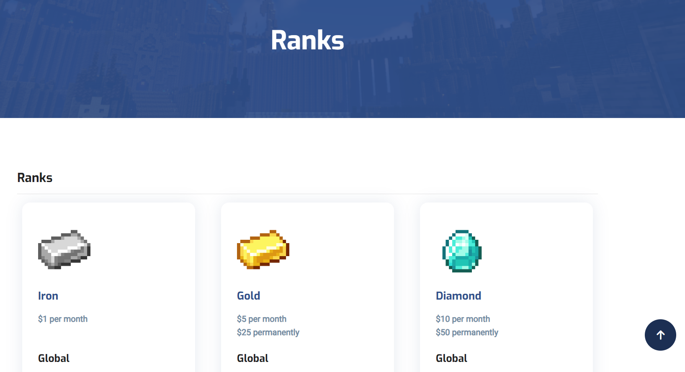
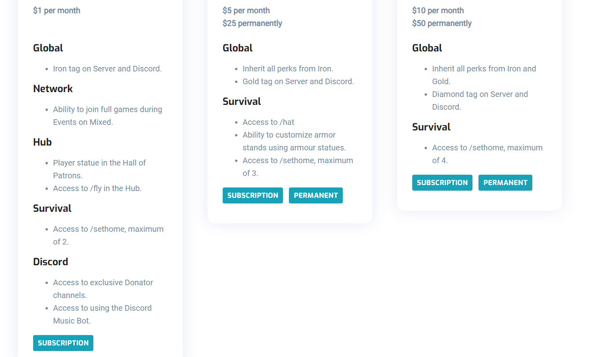
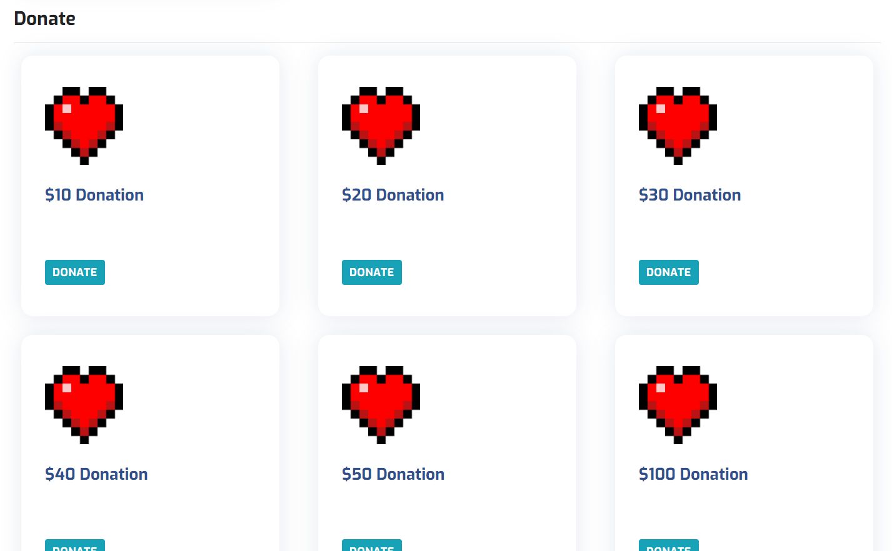

## Introduction
This feature allows administrative users to add and format ranks for your Network.

## Ranks Overview
Ranks are viewed in the order you specify in the configuration.


Ranks are configurable from listing perks, to providing images for your perks, to adding external links to your webstore.


You can also have rank entries that don't have perks and only an external link.



## Managing Ranks
Managing and displaying ranks and entries is easy, we've added below an example of rank configuration how you can best present ranks and donations for your Network:

```
{
  "categories": [
    {
      "displayName": "Ranks",
      "packages": [
        {
          "displayName": "Iron",
          "image": "images/ranks/iron.png",
          "priceMonthly": 1,
          "callToAction": [
            {
              "displayText": "Subscription",
              "redirectUrl": "https://example.com/"
            }
          ],
          "perks": [
            {
              "displayName": "Global",
              "perks": ["Iron tag on Server and Discord."]
            },
            {
              "displayName": "Network",
              "perks": ["Ability to join full games during Events on Mixed."]
            },
            {
              "displayName": "Hub",
              "perks": [
                "Player statue in the Hall of Patrons.",
                "Access to /fly in the Hub."
              ]
            },
            {
              "displayName": "Survival",
              "perks": ["Access to /sethome, maximum of 2."]
            },
            {
              "displayName": "Discord",
              "perks": [
                "Access to exclusive Donator channels.",
                "Access to using the Discord Music Bot."
              ]
            }
          ]
        },
        {
          "displayName": "Gold",
          "image": "images/ranks/gold.png",
          "priceMonthly": 5,
          "priceOneTime": 25,
          "callToAction": [
            {
              "displayText": "Subscription",
              "redirectUrl": "https://example.com/"
            },
            {
              "displayText": "Permanent",
              "redirectUrl": "https://example.com/"
            }
          ],
          "perks": [
            {
              "displayName": "Global",
              "perks": [
                "Inherit all perks from Iron.",
                "Gold tag on Server and Discord."
              ]
            },
            {
              "displayName": "Survival",
              "perks": [
                "Access to /hat",
                "Ability to customize armor stands using armour statues.",
                "Access to /sethome, maximum of 3."
              ]
            }
          ]
        }
      ]
    },
    {
      "displayName": "Donate",
      "packages": [
        {
          "displayName": "$10 Donation",
          "image": "images/ranks/donate.png",
          "price": 10,
          "callToAction": [
            {
              "displayText": "Donate",
              "redirectUrl": "https://crafting-for-christ.tebex.io/package/4028841"
            }
          ]
        },
        {
          "displayName": "$20 Donation",
          "image": "images/ranks/donate.png",
          "price": 20,
          "callToAction": [
            {
              "displayText": "Donate",
              "redirectUrl": "https://crafting-for-christ.tebex.io/package/4028842"
            }
          ]
        }
      ]
    }
  ]
}