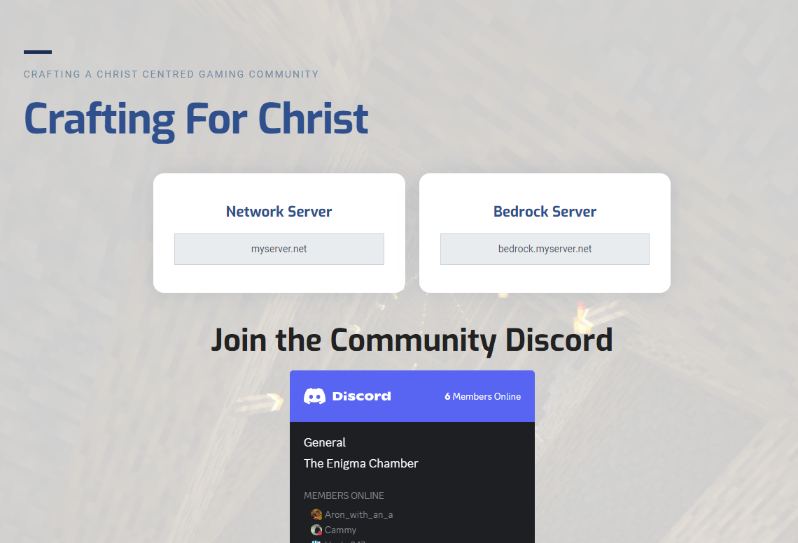
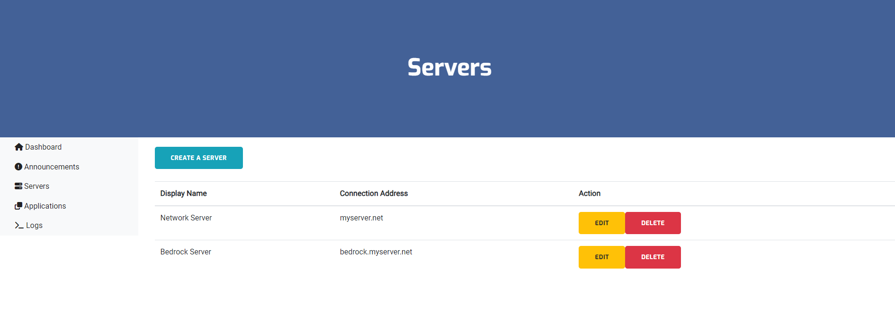
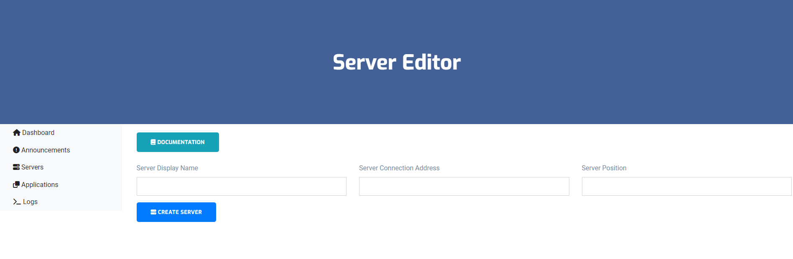

## Introduction
This feature allows administrative users to add, edit and remove Servers. Adding a server will list the server on the `/play` page and also list the server on the `/play` command on Discord.

## Server Overview
Servers are viewed in the order you specify.

## Managing Servers
Creating an server is easy, we've added some notes and options on how you can best create and display for your Network.

### Display Name
The name of the Server.

### Server Connection Address
The display address to indicate what players need to connect to.

### Server Position
Specify the priority or position that the server will be placed.