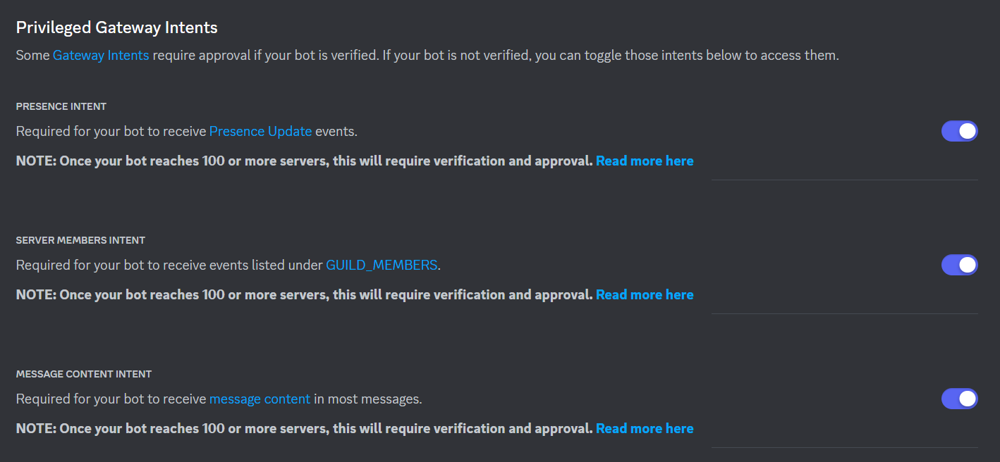

The installation information is as below, this information has been provided in order to ensure the best experience in setting up the zander ecosystem for your Network.

## Requirements
* MySQL Database
* NodeJS (minimum version: 18.18.2)

## Database

* Open the `dbinit.sql` file
* Change the database name if you'd like it to display as a different name.
* Connect to your MySQL server and run the script to load the database onto your database server.

## Web/API

* Clone the Web repo.
* Install all of the required packages using `npm i`
* In the root folder, open the `.env`, `config.json`, `filter.json`, `joinMessages.json`, `features.json` and `lang.json` and fill out as per the instructions in [Configuration](./configuration).
* Run `npm prod` to start the application/website/api.

## Discord

* Visit Discord Developer Portal, and click New Application button, and type your application name, and then Create.
* On the left menu, click Bot, and click Add Bot button.
* Click Reset Token, and click Copy button.

> Referenced from https://discordgsm.com/guide/how-to-get-a-discord-bot-token

* On the Bot tab, under Privileged Gateway, turn on all options.

* Open the Discord channel you want to receive the messages/notifications.
* From the channel menu, select Edit channel.
* Select Integrations.
* If there are no existing webhooks, select Create Webhook. Otherwise, select View Webhooks then New Webhook.
* Enter the name of the bot to post the message.
* `Optional`: Edit the avatar.
* Copy the URL from the WEBHOOK URL field.
* Select Save.
* Enter the Webhook URL into the `discord.webhook` field.

## Proxy

* Clone the zander plugin repo.
* Compile the zander plugin suite.
* Put the zander-proxy plugin in your `plugins` folder on your Proxy.
* Launch the Proxy once, then close the Proxy.
* In the `plugins` folder, open the `config.yml` and fill out as per the instructions in [Configuration](./configuration.md)
* Launch the Proxy again to finish.

## Hub

* Put the zander-hub plugin in your `plugins` folder on your server.
* Launch the server once, then close the server.
* In the `plugins` folder, open the `config.yml` and `welcome.yml` and fill out as per the instructions in [Configuration](./configuration.md)
* Launch the server again to finish.