# Bulk Crafting

## Chests
Using logs to craft a chest will yield 4 chests, making it easier to craft large amounts of chests without needing to break the logs down into planks first.

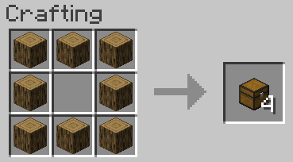

## Logs
Any combination of log-types will work, including stripped logs.

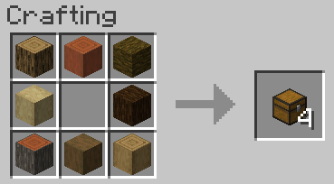

## Bone Blocks

Similarly, Bone blocks can be crafted directly from bones.

## Bundles
The vanilla recipe for Bundles has been enabled.

## Vanilla Crafting Rebalances
Minor changes have been made to vanilla crafting recipes:

### 6-Sided Logs
6-sided log crafting now returns 4 wood, rather than 3.

### Fermented Spider Eyes
Fermented spider eyes can use both red and brown mushrooms.

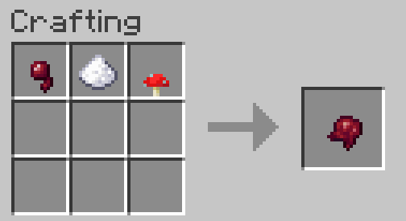

## Bee Nests
The "natural" bee nests can be crafted by combining the "artifical" beehives with honeycomb.

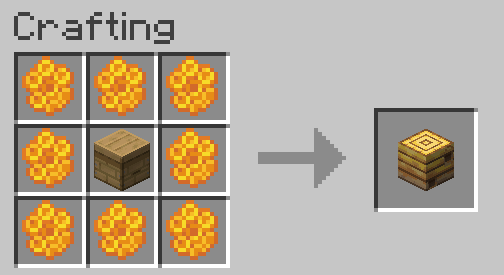

## Chainmail
All chainmail armour can be crafted from chains.

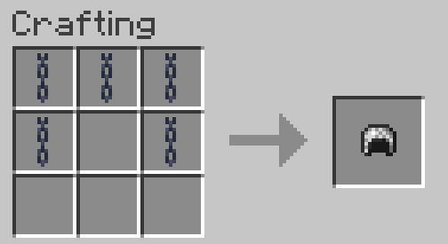

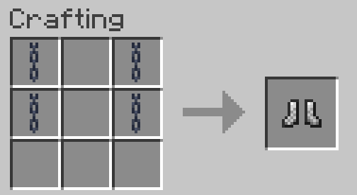

## Dispenser
Dispensers can be crafting a bow around a dropper, making bulk crafting much easier. The vanila recipe is still in place.

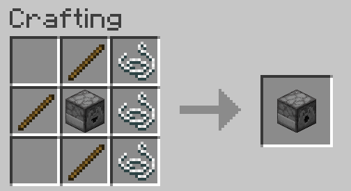

## End Crystal
In addition to the vanilla recipe, two end crystals can be obtained from the Dragon Egg, which is now a guarenteed drop from the Ender Dragon, and can also be found in End City chests.

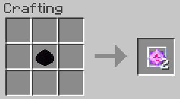

## Elytra
The elytra is craftable from a Diamond Chestplate, an Ender Eye, a Chorus Flower, and 6 Phantom Membrane.

:::note

You must have visited The End dimension first before being able to craft this.

:::

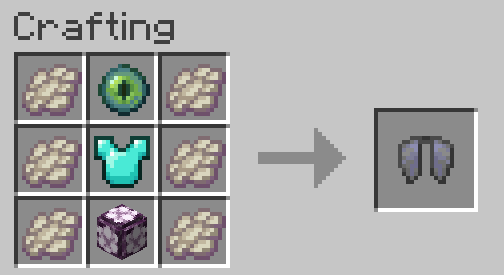

## Bottle-o-Enchanting
The Experience Bottle can be crafted from quartz, glowstone dust, and a water bottle.
In 1.19 this recipe will change to use skulk blocks instead.

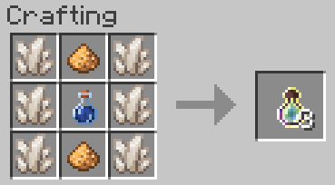

*Insert alternate updated recipe with Skulk*

## Trident
The trident may be crafted from 3 diamond swords (for the tines) and 2 conduits (for the handle).

## Notch Apple
Enchanted Golden Apples can be duplicated by combining a regular golden apple, an enchanted golden apple, and 7 blocks of gold.
This is intended to be reminicent of the original vanilla recipe, and is technically cheaper by 1 ingot.

## Blackstone

### Blackstone
Blackstone can be crafted from Basalt and Cobblestone, both of which are able to be created by lava.

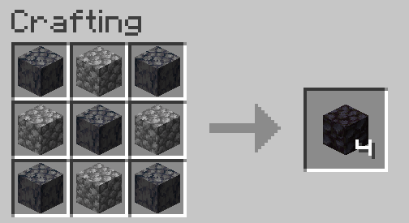

### Guilded Blackstone
Guilded Blackstone can be crafted by surrounding blackstone with gold nuggets.

## Recraftable Gravel
Flint can be repacked into gravel.

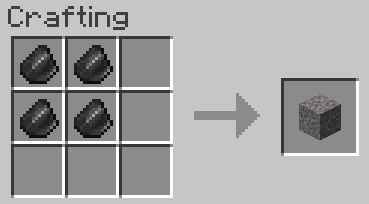

## Rotten Flesh
9 rotten flesh can be crafted into 1 rabbit hide. The vanila recipe can then be used to craft 4 rabbit hide into 1 leather.

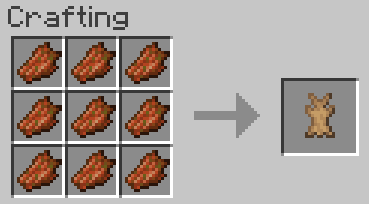

## Sponge Duplication
Crafting together sponge (wet or dry) with coral blocks and corals (of any combination of colour, but must not be dead) will yield 4 sponges.

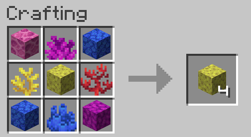

## Unpackable Ice
Blue ice and Packed ice crafting recipes can be reversed, making it a useful way to store ice/water

### Blue Ice

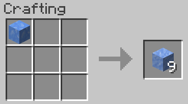

### Packed Ice

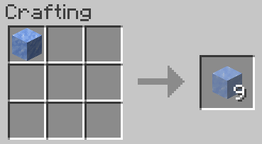